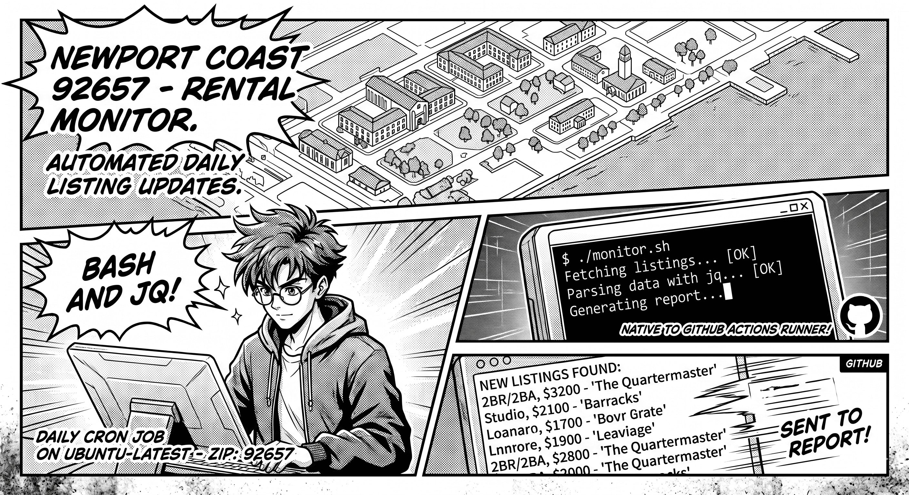

# rental-monitor



A GitHub Actions template that watches rental listings in your target
neighborhood and opens a GitHub Issue whenever new listings appear. Powered
by the [Rentcast API](https://rentcast.io). No code changes required — just
edit a config file, set one secret, and push.

[](../../generate)

---

## How it works

1. A daily cron job (or manual trigger) calls the Rentcast long-term rental
   listings API for your configured ZIP code.
2. Results are filtered by street name and per-bedroom price cap.
3. Listings not seen before are recorded in `data/seen-listings.json`.
4. A GitHub Issue is opened with a digest of every new listing.
5. A heartbeat file (`data/last-run.json`) is committed on every run so you
   can tell the monitor is alive even when there are no new listings.

---

## Setup (under 10 minutes)

### 1. Create your repository from this template

Click **Use this template** above and create a new **private** repository.

> Private is recommended because `data/seen-listings.json` (listing IDs) and
> the raw API artifacts are committed or uploaded to the repo.

### 2. Get a Rentcast API key

1. Sign up at [app.rentcast.io](https://app.rentcast.io)
2. Go to **API** in the sidebar and copy your key.

The free tier provides enough requests for personal daily monitoring.

### 3. Add the secret

In your new repository:

1. Go to **Settings → Secrets and variables → Actions → New repository secret**
2. Name: `RENTCAST_API_KEY`
3. Value: your Rentcast API key

### 4. Edit `monitor-config.yml`

Open `monitor-config.yml` and update the values for your target area:

```yaml
zip_code: "92657"          # Your target ZIP code

streets:                   # Street names to watch (case-insensitive substring match)
  - Newport Coast Dr
  - Crystal Cove

price_caps:                # Max monthly rent per bedroom count
  2br: 5500
  3br: 6000

bedrooms: "2:3"            # Bedroom range for the API query
```

### 5. Push

Commit and push your `monitor-config.yml` changes. The **Setup Validation**
workflow triggers automatically whenever `monitor-config.yml` is pushed to
`main` and will open a GitHub Issue if anything is missing.

> **Using the default config?** If you are happy with the Newport Coast sample
> values and have not edited `monitor-config.yml`, the path-filtered trigger
> will not fire. In that case, go to **Actions → Setup Validation → Run
> workflow** and trigger it manually to confirm your secret is in place.

Once setup passes, wait for the next scheduled run (8 AM Pacific by default)
or trigger the **Rental Monitor** workflow manually from the **Actions** tab.

---

## Adjusting the schedule

Edit the `cron` expression in `.github/workflows/monitor.yml`:

```yaml
- cron: '0 15 * * *'  # 8 AM Pacific (UTC-7 PDT)
```

Use [crontab.guru](https://crontab.guru/) to generate the right expression
for your timezone.

---

## Ad-hoc runs and dry runs

From **Actions → Rental Monitor → Run workflow** you can:

- **Override zip code**: test a different ZIP without editing the config.
- **Dry run**: fetch and filter listings, log matches, but do **not** open
  issues or update `seen-listings.json`. Useful for validating your config
  without burning API quota or spamming issues.

---

## Failure notifications

If the workflow errors (e.g., API key expired, Rentcast outage), it
automatically opens a GitHub Issue labeled `monitor-failure` with a link to
the failed run. You will never mistake silence for success.

---

## Local testing with the fixture

A synthetic fixture at `data/fixtures/sample-response.json` covers the sample
streets and price caps in the default config. You can test the full pipeline
locally without making any API calls:

```bash
# Filter the fixture with jq to verify your street/price logic
jq '[.[] | select((.addressLine1 // "") | test("Newport Coast Dr|Crystal Cove|Pelican Hill|Reef Point|Vista Ridge|Sage Hill"; "i")) | select(.price != null and ((.bedrooms == 2 and .price <= 5500) or (.bedrooms == 3 and .price <= 6000)))]' \
  data/fixtures/sample-response.json
```

Expected: listings `fixture-001`, `fixture-002`, and `fixture-003` pass the
filter. `fixture-004` (over 2br cap), `fixture-005` (wrong street), and
`fixture-006` (over 3br cap) are excluded.

---

## Repository layout

```
.
├── .github/
│   └── workflows/
│       ├── monitor.yml          # Daily rental monitor
│       └── setup.yml            # One-shot setup validation
├── data/
│   ├── fixtures/
│   │   └── sample-response.json # Synthetic listings for local testing
│   ├── last-run.json            # Heartbeat: written on every run
│   └── seen-listings.json       # IDs + first-seen dates; committed by workflow
├── LICENSE
├── NOTICE
├── README.md
└── monitor-config.yml           # Your configuration — edit this
```

---

## Data and privacy

See [NOTICE](NOTICE) for details on Rentcast attribution and personal-use
scope. Key points:

- `data/seen-listings.json` stores **only listing IDs and first-seen dates**,
  not full listing data.
- The raw Rentcast API response is uploaded as an Actions artifact with a
  7-day retention period and is never committed.
- This tool is for **personal, non-commercial use only**.

---

## License

MIT — see [LICENSE](LICENSE).
